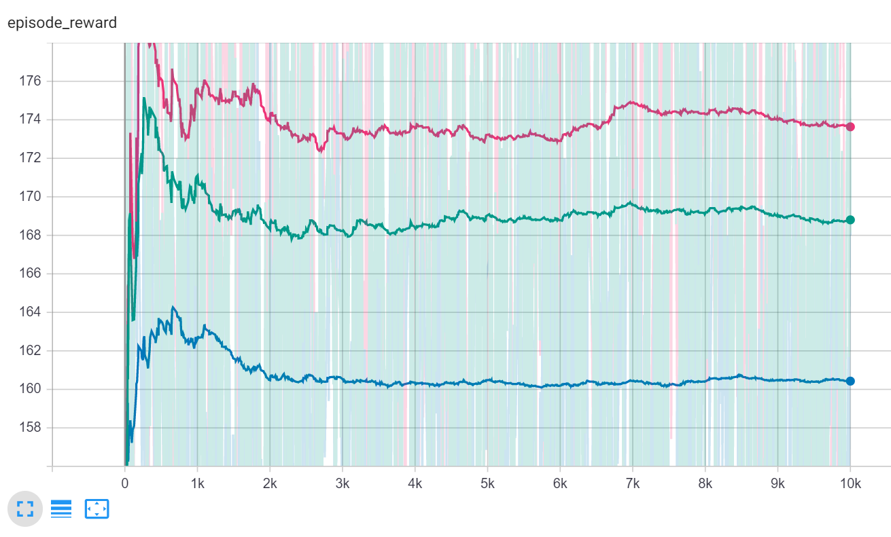

# Implement the Slate Q algorithm

## Current results

* SlateQ - 173.6 (+2.8%)
* Maximize Clicks - 168.8 (baseline)
* Random - 160.4

## Remaining questions

- When there are no clicks, why force Q values to be zero?
- Add episode step as a feature?
